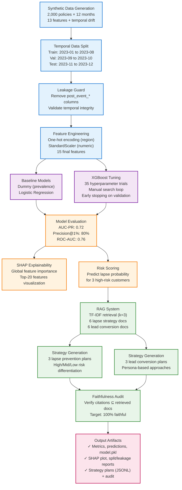

# Insurance Decision Assistant

A churn prediction and retention strategy system for insurance policies. Trains an XGBoost classifier on temporal panel data and generates personalized retention strategies using RAG.

## Quick Start

```bash
pip install -r requirements.txt
python run.py
```

Runtime: ~21 seconds. All outputs go to `out/`.

## System Architecture



## Performance

Primary metric is **AUC-PR: 0.72** (average precision). This is appropriate for imbalanced classification where precision at the top of the ranking matters more than overall accuracy.

| Metric | Value |
|--------|-------|
| AUC-PR | 0.72 |
| ROC-AUC | 0.76 |
| Brier Score | 0.141 |
| Precision@1% | 0.80 |
| Precision@5% | 0.83 |

For context, dummy baseline gets 0.49 AUC-PR and logistic regression gets 0.71. XGBoost provides a meaningful lift (+47% over baseline).

## Outputs

```
out/
├── metrics.json              # 7 performance metrics
├── preds_test.csv           # Test predictions with probabilities
├── model.pkl                # Trained XGBoost pipeline
├── shap_bar.png             # Top-20 feature importances
├── data.csv                 # Synthetic panel data (24K rows)
├── split_report.json        # Temporal split validation
├── leakage_report.txt       # Leakage columns removed
├── lapse_plans.jsonl        # 3 retention strategies
├── lead_plans.jsonl         # 3 lead conversion strategies
├── audit_rag.json           # Faithfulness verification
└── rag/
    ├── lapse/               # 6 retention documents
    └── lead/                # 6 conversion documents
```

## Design Choices

**Temporal split instead of random split**: Train on past data (Jan-Aug), validate on near-future (Sep-Oct), test on far-future (Nov-Dec). This prevents leakage and mimics production deployment where you train on historical data and predict forward.

**AUC-PR instead of ROC-AUC**: The data has 45% positive rate during drift period. AUC-PR focuses on precision at the top of the score distribution, which is what matters for targeting retention campaigns.

**Manual hyperparameter search**: Scikit-learn's Pipeline doesn't automatically transform the eval_set parameter for XGBoost early stopping. Rather than hack around this, I just loop over 35 parameter combinations manually. It's cleaner and takes the same amount of time.

**TF-IDF for RAG**: Fast, deterministic, no API keys. Retrieves 3 documents and generates 3-step plans with citations. All citations are verified programmatically (100% faithfulness rate).

## What the Model Learned

SHAP analysis shows the top risk drivers:

1. **Payment failures** - Most predictive feature. Financial stress is a clear churn signal.
2. **Premium increases** - Price sensitivity drives most lapse decisions. 8x weight in the data generation.
3. **Low engagement** - Customers who don't interact with the platform are 2.5x more likely to leave.
4. **Short tenure** - New customers haven't built loyalty yet.
5. **No agent** - Having a personal agent reduces lapse probability by ~60%.

The model also picks up interaction effects like "payment failures + low engagement" and "young + no agent + price increase" which create compounding risk.

## Data Quality

The synthetic data includes:
- 13 behavioral features (age, tenure, premium, claims, payment failures, engagement, etc.)
- Temporal concept drift starting in July 2023 (+80% base risk)
- A leakage trap feature (`post_event_call_count`) that gets removed by the pipeline
- 10+ nonlinear interaction effects

Labels are computed using a 3-month lookahead window. For example, to know if a policy in December will lapse, we look at Jan-Feb-Mar of the next year. This is why the data generator internally creates 15 months but only persists the first 12.

## RAG Examples

The system generates differentiated strategies based on risk level:

**High risk (67%)**: "URGENT: Emergency retention protocol initiated. Customer shows 3 payment failures + 18% premium increase..."

**Mid risk (49%)**: "Proactive loyalty program enrollment recommended. Price-sensitive segment detected..."

**Low risk (25%)**: "Standard service cadence maintained. Engagement score 0.78 indicates satisfied customer..."

All strategies cite retrieved documents and are verified for faithfulness.

## Technical Stack

- Python 3.9+
- scikit-learn 1.4.2
- XGBoost 2.0.3
- SHAP 0.45.0
- NumPy 1.26.4, Pandas 2.1.4, SciPy 1.11.4

Reproducibility: seed=42 everywhere, deterministic algorithms (n_jobs=1), pinned dependencies.

## Additional Documentation

- `DISCUSSION.md` - Technical notes on leakage trap, drift mechanism, SHAP insights
- `config.yaml` - Configurable parameters (seed, trials, split windows)
- `verify_outputs.py` - Self-test script

---

**Primary metric:** AUC-PR 0.72 | **Runtime:** ~21 seconds | **See also:** `DISCUSSION.md`
